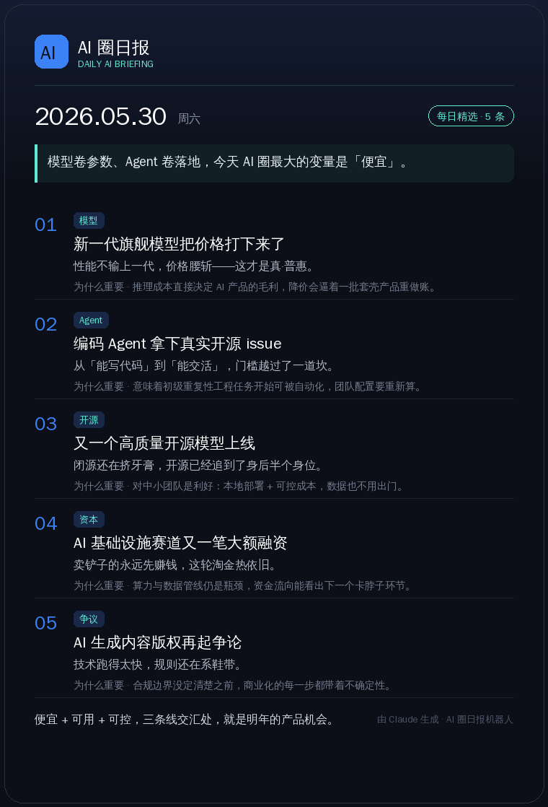

# 🗞️ AI 圈日报机器人

> 把每天的 AI 热点交给 Claude 主编，一键生成**可截图转发的高颜值日报海报**，并能自动发到微信公众号。

一个用 Claude API 驱动的内容自动化工具：你只要把今天看到的 AI 热点丢进去，它就会整理成一份**有态度、有锐评**的日报，渲染成深色渐变卡片海报（适合发小红书 / 朋友圈 / X），还能直接发布到你的微信公众号。

---

## ✨ 亮点

- 🤖 **Claude 当主编**：不是简单摘要，而是带观点的「一句话锐评 + 为什么重要」
- 🎨 **自带传播属性**：输出一张精美海报 HTML，浏览器打开即可截长图转发
- 📰 **一键发公众号**：复用成熟的微信草稿 / 发布流程，自动生成兼容排版
- 🧪 **零门槛体验**：`--demo` 模式无需任何 API key，先看效果再决定
- ⏰ **可自动化**：配合定时任务 / GitHub Actions，每天自动出报

## 🚀 30 秒上手

```bash
pip install -r requirements.txt

# 不配任何 key，直接看日报海报长什么样
python main.py daily --demo
# → 同时生成 HTML（可截图）和 PNG（可直接转发）到 output/
```



> 仓库里附带示例：[`examples/ai-daily-demo.png`](examples/ai-daily-demo.png) / [`examples/ai-daily-demo.html`](examples/ai-daily-demo.html)

## 📝 正式使用

1. 复制配置并填好 key：

   ```bash
   cp .env.example .env
   # 填入 ANTHROPIC_API_KEY（发公众号还需 WECHAT_APP_ID / WECHAT_APP_SECRET）
   ```

2. 把今天的 AI 热点写进 `daily_sources.txt`（每行一条，一句话即可）：

   ```
   某厂发布新一代旗舰大模型，推理价格下降约 50%
   开源编码 Agent 在真实 GitHub issue 基准上首次超过 50%
   ...
   ```

3. 生成日报：

   ```bash
   python main.py daily            # 生成海报到 output/
   python main.py daily --publish  # 生成并发布到公众号
   ```

## 🛠️ 全部命令

| 命令 | 作用 |
| --- | --- |
| `python main.py daily [--demo] [--publish]` | 🌟 生成 AI 圈日报海报，可选发布 |
| `python main.py test` | 校验 微信 / Anthropic API 凭证 |
| `python main.py generate --topic "主题"` | 生成单篇文章预览（不发布） |
| `python main.py publish --topic "主题"` | 生成并发布一篇文章 |
| `python main.py batch --file topics.txt` | 按主题列表批量发布 |
| `python main.py schedule --topic "..."` | 每天定时自动发布 |
| `python main.py log` | 查看最近发布记录 |

## 📦 项目结构

```
main.py                  # CLI 入口
daily_sources.txt        # 每日 AI 热点输入（你来填）
src/
  daily_digest.py        # 🌟 Claude 主编：热点 → 结构化日报
  digest_card.py         # 🌟 渲染海报 HTML + 微信兼容 HTML
  poster_png.py          # 🌟 直接导出 PNG 分享图（无需浏览器）
  content_generator.py   # 单篇文章生成
  html_template.py       # 公众号 inline-style 排版
  wechat_api.py          # 微信公众号 API 封装
  topic_manager.py       # 主题按日轮转
  publish_log.py         # 发布记录
```

## ⚙️ 工作原理

```
daily_sources.txt ─► Claude 主编（src/daily_digest.py）
                          │  产出结构化 JSON：卷首语 + 精选条目 + 收尾
                          ▼
                  src/digest_card.py
                     ├─► 海报 HTML（截图转发）
                     └─► 微信 inline HTML ─► 公众号草稿 / 发布
```

## 🤝 欢迎贡献

觉得有用的话点个 ⭐ Star 支持一下！欢迎提 issue / PR：更多海报主题、更多内容源、更多平台分发。

> 由 Claude 生成内容，请在发布前对事实进行核对。
